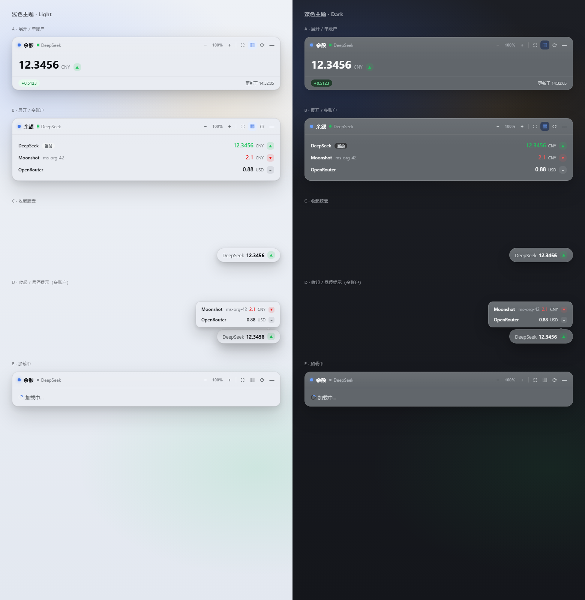
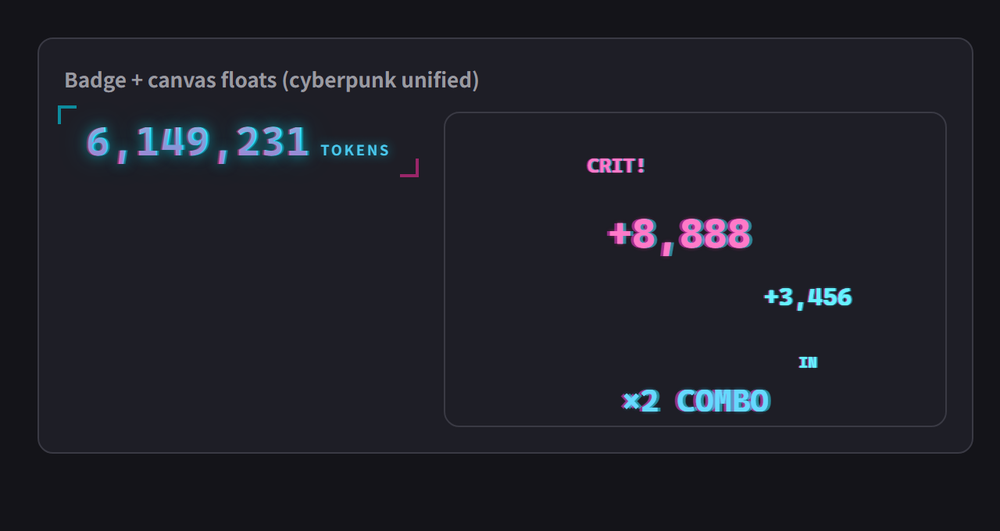
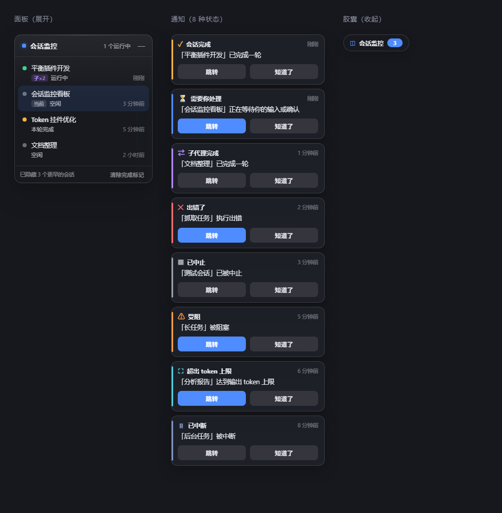
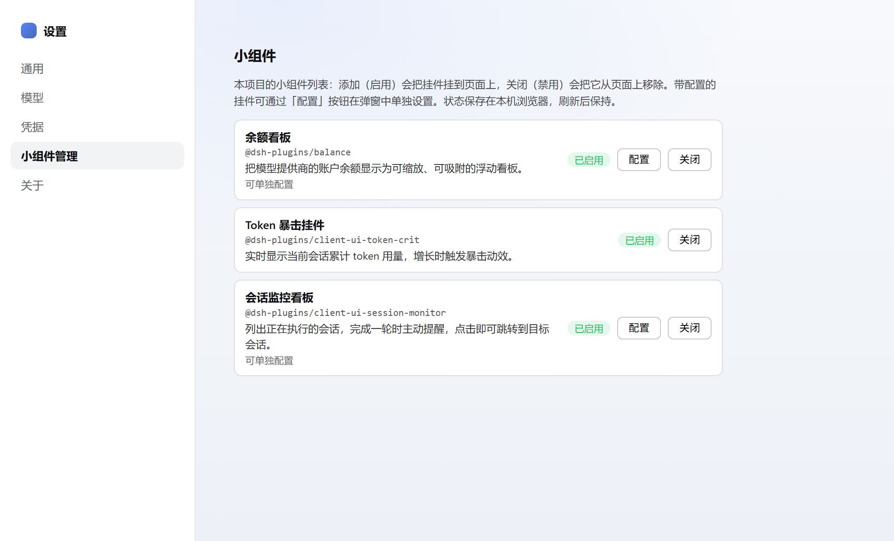

# dsh 小组件集合

一个面向 DeepSeek Harness 的小组件（挂件 / widgets）monorepo。这里主要制作一些
「小组件」：每个组件都是可独立发布、可在任意 DeepSeek Harness 实例中安装的插件，
浏览器端通常以 `shell.overlay` 浮动挂件或 Web 设置页的形式呈现，可拖动、可缩放、
可折叠、可配置。当前仓库包含三个小组件：

| 小组件 | 包 | 说明 |
|---|---|---|
| 余额看板 | `@dsh-plugins/balance` | 一个包 = `ctx.balance` 能力缝隙 + 5 个厂商 Provider + 用户绑定设置 + 浮动余额看板；支持单账户 / 多账户视图、趋势涨跌、动态滚动、缩放与角落吸附，供应商配置在小组件管理的「配置」弹窗中完成 |
| Token 暴击挂件 | `@dsh-plugins/client-ui-token-crit` | 浮动的 token 用量计量挂件；实时显示当前会话累计 token 用量，增长时触发网游风格暴击动效，附带可配置面板 |
| 会话监控看板 | `@dsh-plugins/client-ui-session-monitor` | 浮动的会话监控面板；列出正在执行的会话与运行状态，会话完成一轮时主动弹提醒（可自动消失或需确认），点击任意会话一键跳转 |

## 预览

| 余额看板 | Token 暴击挂件 | 会话监控看板 |
| :---: | :---: | :---: |
|  |  |  |

| 小组件管理设置页 |
| :---: |
|  |

> 前三张为挂件的静态状态预览；实际挂件可拖动、缩放、折叠，动效与完整交互见
> [使用](#使用) 及各子包 README。最后一张是 Web 设置里的「小组件管理」设置页。

## 结构

| 包 | 角色 |
|---|---|
| `@dsh-plugins/balance` | 合并后的余额插件（Host 缝隙 + 厂商 + Web 看板，单插件行）：`ctx.balance` 绑定提供商路由并应答 `balance/query` / `balance/list` Remote；5 个厂商 Provider + 设置驱动的用户绑定 + `/_dsh/balance/settings` Web 路由；浏览器半挂载 Remote 并注册看板挂件与配置面板 |
| `@dsh-plugins/client-ui-token-crit` | Token 暴击挂件（浏览器端，纯 UI） |
| `@dsh-plugins/client-ui-session-monitor` | 会话监控看板（双半：Host 半 turn/end 原因跟踪 + 状态路由；浏览器端列出运行中会话、按状态提醒、点击跳转） |
| `@dsh-plugins/client-ui-widget-manager` | 小组件管理设置页（浏览器端）：列出小组件并支持「添加 / 关闭」，为带配置的挂件提供「配置」弹窗 |
| `@dsh-plugins/balance-bundle` | 可安装 bundle：一层挂载以上全部插件 |

> 完整的组件管理列表（组件明细、插槽注册、构建产物、依赖关系、维护清单）见
> [COMPONENTS.md](COMPONENTS.md)。
> 开发新小组件并接入「小组件管理」面板（含配置弹窗）的完整指南见
> [WIDGET-DEVELOPMENT.md](WIDGET-DEVELOPMENT.md)。

## 前置条件

- 宿主 DeepSeek Harness 版本需已把 `./remote`（`balance/query`、`balance/list`）挂载进 client 的 `api-remotes`（Harness 仓库内已在 `packages/api/remotes` 挂载 `balanceRemote`）。若宿主未挂载，Host 侧服务仍可安装，但余额看板无法查询余额（表现为「未绑定」）。Token 暴击挂件仅依赖标准 `useSessions` 会话投影；会话监控看板依赖标准 `useSessions` 加自身的 `/_dsh/session-monitor/status` 轮询（Host 半，核心 `dsh-session` 事件，无此 remote 要求）。
- Host 需要 `@deepseek-ai/dsh-settings` 与 `@deepseek-ai/dsh-credentials` 能力（web profile 自带）。

## 构建

```sh
pnpm install
pnpm build   # 等价于 node scripts/build.mjs
```

`pnpm build` 用 esbuild 构建各包的 Host 与浏览器产物（`lib/`），包自带构建产物，安装即用，无需在安装端构建。

> `@dsh-plugins/balance` 的 `lib/typert.*`（生成的 Remote 线协议）由 typert codegen
> 产出，不在 `pnpm build` 内重建；它们随包发布（`files: ["lib"]`）。全新 clone 后若
> 缺失，需要从发布 tarball 或 typert codegen 恢复。

## 发布

所有包都是 `@dsh-plugins/*` scoped 包，各 `package.json` 已带
`"publishConfig": { "access": "public" }`，可直接公开发布：

```sh
pnpm -r publish --no-git-checks   # 等价于 npm run publish:all
```

发布前可用 `pnpm pack`（在每个包目录）检查产物清单；bundle 的
`workspace:*` 依赖会在打包时自动改写为实际版本号。

## 安装（推荐：bundle）

1. 在宿主环境安装 bundle 包：`npm install @dsh-plugins/balance-bundle`。
2. 把 `@dsh-plugins/balance-bundle` 加进目标 profile 的 `dsh.profile.bundles`（profile 的 package.json），例如：
   ```json
   { "dsh": { "profile": { "bundles": ["@deepseek-ai/dsh-base", "@deepseek-ai/dsh-web-app", "@dsh-plugins/balance-bundle"] } } }
   ```
3. 重启 `dsh web`。

bundle 的 `cordis.patch.yml` 会插入 `balance`、`ui-token-crit`、`ui-session-monitor`、
`ui-widget-manager` 四行，一次挂载全部组件。

## 安装（手动）

在 profile 的 `cordis.patch.yml`（或自定义 `--patch`）加入：

```yaml
- insert:
    - id: balance
      name: '@dsh-plugins/balance'
      config:
        requestTimeoutMs: 10000
        newApiBaseURL: http://localhost:3000   # New API 自托管实例地址
        bindings: []
    - id: ui-token-crit
      name: '@dsh-plugins/client-ui-token-crit'
    - id: ui-session-monitor
      name: '@dsh-plugins/client-ui-session-monitor'
    - id: ui-widget-manager
      name: '@dsh-plugins/client-ui-widget-manager'
```

## 使用

各小组件的详细使用方式（含配置示例）见对应子包 README：

- **余额插件**（[`balance/README.zh.md`](packages/dsh-balance/README.zh.md)）——厂商清单、凭据、自定义绑定、看板操作
- **Token 暴击挂件**（[`client-ui-token-crit/README.zh.md`](packages/dsh-client-ui-token-crit/README.zh.md)）——查看用量、调整形态、设置面板
- **会话监控看板**（[`client-ui-session-monitor/README.zh.md`](packages/dsh-client-ui-session-monitor/README.zh.md)）——查看运行中会话、完成一轮提醒、点击跳转、配置项
- **小组件管理**（[`client-ui-widget-manager/README.zh.md`](packages/dsh-client-ui-widget-manager/README.zh.md)）——在 Web 设置里列出小组件，可「添加（启用）/ 关闭（禁用）」；带配置的挂件（如余额看板）通过行上的「配置」按钮在独立弹窗中设置，不再占用设置菜单页

### 余额看板（速览）

1. Web 设置 → 「小组件管理」→ 余额看板 → **配置**（弹窗）→ 添加绑定：提供商路由（如 `new-api`）、厂商类型（`new-api` / `deepseek` / `moonshot` / `openrouter` / `siliconflow`）、凭据引用（如 `NEW_API_KEY`）、可选 Base URL（自托管网关）。
2. 把对应令牌存入该凭据引用（`$DSH_HOME/.credentials.yaml` 或 Web 设置里的凭据管理）。
3. 看板默认显示当前会话所用提供商的余额；点 `▦` 切换到多账户视图；收起胶囊默认显示当前账户，其他供应商余额变化时短暂显示 3 秒。

### Token 暴击挂件（速览）

纯 UI 挂件，无需凭据。打开会话后 `shell.overlay` 中即出现可拖动 / 可缩放 / 可折叠的透明挂件，实时显示当前会话累计 token 用量；点 ⚙ 打开设置面板，可调节语言、数字格式 / 字号、标签、连击、粒子、暴击阈值 / 比例、音效、边缘泛光，位置与缩放写入 `localStorage`。

### 会话监控看板（速览）

无需凭据。挂载后 `shell.overlay` 右下角出现「会话监控」面板，列出存活会话（运行中置顶并带呼吸绿点，子代理默认过滤、可配时间范围）；点任意行立即跳到该会话。会话完成一轮时弹出提醒条，**按状态配色**（正常完成 / 需要你处理 / 出错 / 中止 / 阻塞 / 超出 token 上限等，Host 半提供结束原因）——点「跳转」直达、点「知道了」关闭；在小组件管理的「配置」弹窗里可调提醒开关 / 关闭方式（自动消失或需确认）/ 秒数 / 音效 / 浏览器通知 / 提醒范围与列表显示。注意：区分出错/中止等状态需要 Host 半，安装后需重启 web 服务一次。

## 许可

MIT。厂商接口与配额换算说明见各子包 README。
