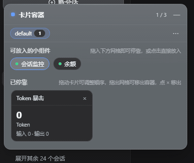
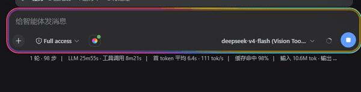

# dsh 小组件集合

一个面向 DeepSeek Harness 的小组件（挂件 / widgets）monorepo。这里主要制作一些
「小组件」：每个组件都是可独立发布、可在任意 DeepSeek Harness 实例中安装的插件，
浏览器端通常以 `shell.overlay` 浮动挂件或 Web 设置页的形式呈现，可拖动、可缩放、
可折叠、可配置。当前仓库包含五个小组件：

| 小组件 | 包 | 说明 |
|---|---|---|
| 余额看板 | `@dsh-plugins/balance` | 一个包 = `ctx.balance` 能力缝隙 + 5 个厂商 Provider + 用户绑定设置 + 浮动余额看板；支持单账户 / 多账户视图、趋势涨跌、动态滚动、缩放与角落吸附，供应商配置在小组件管理的「配置」弹窗中完成 |
| Token 暴击挂件 | `@dsh-plugins/client-ui-token-crit` | 浮动的 token 用量计量挂件；实时显示当前会话累计 token 用量，增长时触发网游风格暴击动效，附带可配置面板 |
| 会话监控看板 | `@dsh-plugins/client-ui-session-monitor` | 浮动的会话监控面板；列出正在执行的会话与运行状态，会话完成一轮时主动弹提醒（可自动消失或需确认），点击任意会话一键跳转 |
| 卡片容器 | `@dsh-plugins/client-ui-card-container` | 浮动的卡片容器面板；开启后把其他小组件拖进一个整齐、等间距的卡片网格集中摆放（浮窗自动收起，可拖拽排序 / 移出） |
| 彩虹流光 | `@dsh-plugins/client-ui-rainbow-flow` | 输入框装饰（非浮窗）：会话运行时输入框四周环绕一圈柔和的彩虹光晕，像呼吸一样明暗脉动（内部透明不遮输入），呼吸节奏随每秒输出 token 数动态变化，工具行带开/关开关 |

除了上面五个浏览器内小组件，还有一个配套的 **Windows 桌面悬浮窗应用**
（`desktop/dsh-session-desktop/`，Tauri 2，非 npm 包）：把「会话监控」做成无边框、
半透明、置顶的小窗悬浮在桌面上，完成一轮时弹桌面提醒（详见文末「桌面悬浮窗」）。

## 预览

> 动图（GIF）演示实际交互与动效，静态图为多状态拼图；全部预览来自真实运行中的
> Harness 实例。挂件均可拖动、缩放、折叠，完整操作见 [使用](#使用) 及各子包 README。

### 浮动挂件

| 余额看板 |                                        Token 暴击挂件                                        | 会话监控看板 | 卡片容器 |
| :---: |:--------------------------------------------------------------------------------------------:| :---: | :---: |
|  |  |  |  |
| 单 / 多账户、趋势涨跌、缩放吸附 |                                     实时用量 + 暴击动效                                      | 会话列表、完成提醒、点击跳转 | 拖入网格停靠成卡片，可排序 / 移出 |

### 输入框装饰

| 彩虹流光 |
| :---: |
|  |
| 会话运行时输入框四周的呼吸彩虹光晕（明暗脉动 + 轻微缩放），呼吸节奏随输出 token 速率变化 |

### 设置页

| 小组件管理 |
| :---: |
|  |
| Web 设置里启用 / 关闭小组件；带配置的挂件（如余额看板）通过「配置」弹窗单独设置 |

## 结构

| 包 | 角色 |
|---|---|
| `@dsh-plugins/balance` | 合并后的余额插件（Host 缝隙 + 厂商 + Web 看板，单插件行）：`ctx.balance` 绑定提供商路由并应答 `balance/query` / `balance/list` Remote；5 个厂商 Provider + 设置驱动的用户绑定 + `/_dsh/balance/settings` Web 路由；浏览器半挂载 Remote 并注册看板挂件与配置面板 |
| `@dsh-plugins/client-ui-token-crit` | Token 暴击挂件（浏览器端，纯 UI） |
| `@dsh-plugins/client-ui-session-monitor` | 会话监控看板（双半：Host 半 turn/end 原因跟踪 + 状态路由；浏览器端列出运行中会话、按状态提醒、点击跳转） |
| `@dsh-plugins/client-ui-card-container` | 卡片容器（浏览器端，纯 UI）：声明 `widgets.card` 子槽并渲染停靠卡片，用影子条目隐藏已停靠挂件的浮窗，自带 token-crit / session-monitor / balance 的紧凑卡片视图 |
| `@dsh-plugins/client-ui-rainbow-flow` | 彩虹流光（浏览器端，纯 UI）：会话运行时输入框四周的呼吸彩虹光晕（`conversation.input.left`），明暗脉动节奏随输出 token 速率变化，工具行带开/关开关 |
| `@dsh-plugins/client-ui-widget-manager` | 小组件管理设置页（浏览器端）：列出小组件并支持「添加 / 关闭」，为带配置的挂件提供「配置」弹窗 |
| `@dsh-plugins/dsh-widgets-plugin` | 可安装 bundle：一层挂载以上全部插件 |
| `desktop/dsh-session-desktop/` | Windows 桌面悬浮窗应用（Tauri 2，**非 npm 包**）：无边框/透明/置顶小窗加载会话监控独立挂件页，托盘唤回，点击行直达已打开的 Harness 标签页（未开才回退浏览器） |

> 完整的组件管理列表（组件明细、插槽注册、构建产物、依赖关系、维护清单）见
> [COMPONENTS.md](COMPONENTS.md)。
> 开发新小组件并接入「小组件管理」面板（含配置弹窗）的完整指南见
> [WIDGET-DEVELOPMENT.md](WIDGET-DEVELOPMENT.md)。

## 前置条件

- 宿主 DeepSeek Harness 版本需已把 `./remote`（`balance/query`、`balance/list`）挂载进 client 的 `api-remotes`（Harness 仓库内已在 `packages/api/remotes` 挂载 `balanceRemote`）。若宿主未挂载，Host 侧服务仍可安装，但余额看板无法查询余额（表现为「未绑定」）。Token 暴击挂件仅依赖标准 `useSessions` 会话投影；会话监控看板依赖标准 `useSessions` 加自身的 `/_dsh/session-monitor/status` 轮询（Host 半，核心 `dsh-session` 事件，无此 remote 要求）。
- Host 需要 `@deepseek-ai/dsh-settings` 与 `@deepseek-ai/dsh-credentials` 能力（web profile 自带）。

## 构建

```sh
pnpm install
pnpm build   # 等价于 node scripts/build.mjs
```

pnpm 版本由 root `package.json` 的 `packageManager` 固定（`pnpm@11.7.0`，与官方
deepseek-harness 同款做法）；`pnpm/action-setup` 会按该字段安装对应版本，本机用
corepack 管理时也会读取同一字段。Node 引擎约束见 root `engines`
（`^22.19.0 || >=24.0.0`）。

`pnpm build` 用 esbuild 构建各包的 Host 产物（`lib/index.js`），用 **Vite
library mode**（官方 deepseek-harness 的 Web 工具链）构建浏览器端 bundle
（`lib/client.js`，ModuleLoader CJS + 内联 CSS），并额外用 tsc 从 src
重新生成 `@dsh-plugins/balance` 的类型面（`lib/types/**`），末尾校验所有 `exports`
目标文件存在。包自带构建产物，安装即用，无需在安装端构建。

> `@dsh-plugins/balance` 的 `lib/typert.*`（生成的 Remote 线协议）由 typert codegen
> 产出，不在 `pnpm build` 内重建；仓库内没有生成工具，因此这 4+1 个文件已**提交进
> git**（`.gitignore` 有豁免段），随包发布（`files: ["lib"]`）。改 Remote 线协议时
> 需要从上游/typert codegen 重新生成后提交。

## 发布

所有包都是 `@dsh-plugins/*` scoped 包，各 `package.json` 已带
`"publishConfig": { "access": "public" }`，可直接公开发布：

```sh
pnpm -r publish --no-git-checks   # 等价于 npm run publish:all
```

发布前可用 `pnpm pack`（在每个包目录）检查产物清单；bundle 的
`workspace:*` 依赖会在打包时自动改写为实际版本号。

## 安装

两种安装方式：**发布安装**（推荐——装的是预构建产物，安装端零构建授权）与**本地开发
安装**（`link:` 直连本仓库，适合改代码调试）。手动 patch 见文末「安装（手动）」。

### 方式一：发布安装（推荐）

发布到 npm 后，用官方 `dsh plugin` 命令把它装进目标 profile——命令在 profile 目录内
转发给 pnpm，自动安装依赖并把 bundle 追加进 `dsh.profile.bundles`：

```sh
dsh plugin --profile <name> add @dsh-plugins/dsh-widgets-plugin
```

验证与启动：

```sh
dsh --profile <name> --dump-config   # 应出现 "# == @dsh-plugins/dsh-widgets-plugin" 层
dsh --profile <name>
```

bundle 的 `cordis.patch.yml` 会插入 `balance`、`ui-token-crit`、`ui-session-monitor`、
`ui-card-container`、`ui-widget-manager` 五行，一次挂载全部组件。发布物自带构建产物
（`lib/`），安装端无需构建授权。

### 方式二：本地开发安装（link 直连本仓库）

开发 / 调试时直接把本仓库的 bundle 装进 profile，pnpm 以 `link:` 依赖链接
（junction 直连，不拷贝）：

```sh
dsh plugin --profile <name> add F:/dsh-balance-plugin/bundles/dsh-widgets-plugin
```

首次使用会初始化 profile（`@deepseek-ai/dsh-base` 作为第一个 bundle）。改代码后先在
仓库根 `pnpm build` 更新 `lib/` 产物，再重启 `dsh web`（Host 半改动）或刷新页面
（浏览器半改动）。

> **不支持 `github:` 直接安装**：git 安装拉取的是源码、不跑任何构建，且 bundle 的
> `workspace:*` 依赖在 workspace 之外无法解析
> （`ERR_PNPM_WORKSPACE_PKG_NOT_FOUND`）。给别人用请走方式一（npm 发布）或
> `pnpm pack` 交付 tarball。

## 安装（手动）

在 profile 的 `cordis.patch.yml`（或自定义 `--patch`）加入：

```yaml
- insert:
    - id: balance
      name: '@dsh-plugins/balance'
      config:
        requestTimeoutMs: 10000
        newApiBaseURL: http://localhost:3000   # New API 自托管实例地址
        bindings: []
    - id: ui-token-crit
      name: '@dsh-plugins/client-ui-token-crit'
    - id: ui-session-monitor
      name: '@dsh-plugins/client-ui-session-monitor'
    - id: ui-card-container
      name: '@dsh-plugins/client-ui-card-container'
    - id: ui-widget-manager
      name: '@dsh-plugins/client-ui-widget-manager'
```

## 使用

各小组件的详细使用方式（含配置示例）见对应子包 README：

- **余额插件**（[`balance/README.zh.md`](packages/dsh-balance/README.zh.md)）——厂商清单、凭据、自定义绑定、看板操作
- **Token 暴击挂件**（[`client-ui-token-crit/README.zh.md`](packages/dsh-client-ui-token-crit/README.zh.md)）——查看用量、调整形态、设置面板
- **会话监控看板**（[`client-ui-session-monitor/README.zh.md`](packages/dsh-client-ui-session-monitor/README.zh.md)）——查看运行中会话、完成一轮提醒、点击跳转、配置项
- **卡片容器**（[`client-ui-card-container/README.zh.md`](packages/dsh-client-ui-card-container/README.zh.md)）——把其他小组件拖进整齐的卡片网格集中摆放
- **小组件管理**（[`client-ui-widget-manager/README.zh.md`](packages/dsh-client-ui-widget-manager/README.zh.md)）——在 Web 设置里列出小组件，可「添加（启用）/ 关闭（禁用）」；带配置的挂件（如余额看板）通过行上的「配置」按钮在独立弹窗中设置，不再占用设置菜单页

### 余额看板（速览）

1. Web 设置 → 「小组件管理」→ 余额看板 → **配置**（弹窗）→ 添加绑定：提供商路由（如 `new-api`，可从候选中选择或自行输入）、厂商类型（`new-api` / `deepseek` / `moonshot` / `openrouter` / `siliconflow`）、凭据引用（如 `NEW_API_KEY`）、可选 Base URL（自托管网关）。
2. 把对应令牌存入该凭据引用（`$DSH_HOME/.credentials.yaml` 或 Web 设置里的凭据管理）。
3. 看板默认显示当前会话所用提供商的余额；点 `▦` 切换到多账户视图；收起胶囊默认显示当前账户，其他供应商余额变化时短暂显示 3 秒。

### Token 暴击挂件（速览）

纯 UI 挂件，无需凭据。打开会话后 `shell.overlay` 中即出现可拖动 / 可缩放 / 可折叠的透明挂件，实时显示当前会话累计 token 用量；点 ⚙ 打开设置面板，可调节语言、数字格式 / 字号、标签、连击、粒子、暴击阈值 / 比例、音效、边缘泛光，位置与缩放写入 `localStorage`。

### 会话监控看板（速览）

无需凭据。挂载后 `shell.overlay` 右下角出现「会话监控」面板，列出存活会话（运行中置顶并带呼吸绿点，子代理默认过滤、可配时间范围）；点任意行立即跳到该会话。会话完成一轮时弹出提醒条，**按状态配色**（正常完成 / 需要你处理 / 出错 / 中止 / 阻塞 / 超出 token 上限等，Host 半提供结束原因）——点「跳转」直达、点「知道了」关闭；在小组件管理的「配置」弹窗里可调提醒开关 / 关闭方式（自动消失或需确认）/ 秒数 / 音效 / 浏览器通知 / 提醒范围与列表显示。注意：区分出错/中止等状态需要 Host 半，安装后需重启 web 服务一次。

### 卡片容器（速览）

纯 UI 挂件，无需凭据。在小组件管理页启用「卡片容器」后，左上角出现容器面板：上方「可放入的小组件」托盘列出当前已启用的挂件，把 chip 拖进下方网格（或直接点击）即停靠——挂件的浮窗自动隐藏，网格内显示它的紧凑卡片（token-crit / session-monitor 为内置统计卡，balance 为通用卡）；拖动卡片可调整顺序，点 × 移出容器恢复浮窗。列数在「配置」弹窗里调（自适应 / 2 / 3 / 4 列），停靠顺序与面板位置刷新后保留。

### 桌面悬浮窗（速览）

「会话监控」的 Windows 桌面版（`desktop/dsh-session-desktop/`，Tauri 2 应用，
非 npm 包）：

1. 前置：本机 Harness web 服务已运行（`dsh web`，默认 `http://127.0.0.1:3080`）
   且已安装本仓库 bundle（插件 Host 半提供数据与挂件页）。
2. 构建（首次需拉取 crates，10–30 分钟）：`cd desktop/dsh-session-desktop &&
   npm install && npx tauri build --no-bundle`，产物在
   `src-tauri/target/release/dsh-session-monitor-desktop.exe`。
3. 双击运行：窗口先显示「正在连接 Harness…」，就绪后自动进入挂件页——列出
   运行中/刚完成的会话，完成一轮弹按状态配色的桌面提醒；点会话行（或 toast
   「跳转」）：**已开着的 Harness 网页标签页直接切到该会话（不新开窗口）**，
   网页没开时才回退系统浏览器；⚙ 设置与网页版（小组件管理 → 配置）**共享同一份
   配置**（完成提醒/通知方式/提示音/只显示运行中/子代理/时间范围，双向实时同步，
   仅刷新间隔为桌面独有）；头部可拖拽，📌 置顶、✕ 隐藏（托盘左键/菜单「显示挂件」
   唤回，「退出」结束进程）。

详细说明见 [`desktop/dsh-session-desktop/README.md`](desktop/dsh-session-desktop/README.md)。

## 许可

MIT。厂商接口与配额换算说明见各子包 README。
