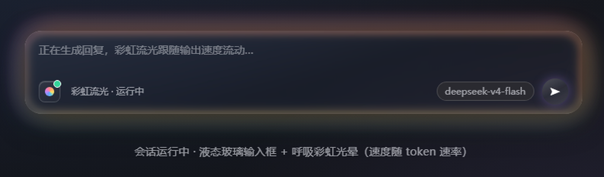

# @dsh-plugins/client-ui-rainbow-flow

[English](README.md) | 中文

纯 UI 的 web 端插件：会话运行时，输入框变成透明液态玻璃面板，一圈柔和的**彩虹
光晕**像呼吸一样**明暗脉动**——吸入、呼出——呼吸节奏随每秒输出 token 数动态
变化；输入框工具行里有一个开/关开关，小组件管理页提供**配置面板**（透明度/
速度/冷色调），并对输入框的主操作**发送/停止按钮**做**液态玻璃**图标美化 +
动态效果。

## 预览



## 特性

- **整个输入框是通透玻璃**：彩虹流开关开启时，输入框卡片本身变成**通透的
  玻璃面板**——产品自带实心深色背景被替换为**柔和白色玻璃渐变**（两段：
  淡淡的光穿过玻璃），并借卡片 `::before` **轻磨砂层（blur 5px + 强增饱和）**
  让卡片背后的内容（页面、浮动挂件、聊天区）**清晰而鲜艳地透出**——通透靠的
  是磨砂本身，增饱和让背后色彩透过玻璃发光；**上下边缘各一条 1px 细反光线**（顶部亮、底部柔）捕捉光线、让玻璃边缘
  有存在感——克制精致，没有大片高光弧。在深色主题下，淡白玻璃让卡片比背景
  稍亮一档（玻璃识别度保留）同时保持通透；在亮色主题下玻璃自动加深为高对比
  面板、按钮图标翻转为深色保证可读——玻璃材质是**主题感知**的（`--rf-glass-*`
  token，暗/亮两套调色板）。输入框就是一块透光玻璃，**没有可见的环带或边框**
  ——唯一的边缘装饰就是呼吸光晕本身。（磨砂层放在卡片的 `::before` 伪元素上
  而不是卡片本身——因为卡片级 `backdrop-filter` 会成为内部 fixed 定位 Tooltip
  气泡的 containing block、把气泡打出屏幕；`::before` 与那些内容是兄弟关系，
  弹层不受影响。）关闭开关即恢复原厂不透明卡片，完全不动产品外观。效果自动
  跟随卡片高度（绝对定位层挂在卡片内部，无需测量）。
- **呼吸节奏跟随 token 速率**：每 500ms 采样一次流式 `partial` 内容，估算每秒
  输出 token 数（约 2 字符/token，EMA 平滑）；呼吸周期在 5s（慢）↔ 1s（快）
  之间映射——静止时是舒缓的深呼吸，峰值输出时是轻快的急促呼吸。模型输出越快
  光晕呼吸得越快，思考/调用工具的间隙平滑回落到慢速呼吸。**快慢之间有平滑
  过渡**：rAF 循环里呼吸频率以指数缓动逼近采样目标并连续积分呼吸相位（不再
  直接改 `animation-duration`），加减速平滑、呼吸不跳拍。每帧只写光晕层的
  opacity 与 transform（合成器友好，静态 box-shadow 层只栅格化一次），**没有
  任何重栅格化**。
- **一圈呼吸的光晕**：彩虹边缘是**一圈贴合卡片圆角的柔光**——**16 个方向的
  box-shadow，每个方向一个纯彩虹色相**（间隔 22.5°、完整色轮：红→橙→黄→绿→
  青→蓝→紫→粉，两两之间还有中间色）。普通的堆叠阴影会把所有颜色在整个边缘
  混合成一团脏色；给每层加一个小方向偏移，让色相分布到卡片四周，配合小偏移 +
  宽 blur 让每个色相与左右相邻色都重叠——**平滑连续的彩虹渐变，完全看不出分段**。
  box-shadow 天然在**元素外侧**，所以卡片内部完全干净（输入框本身从不被染色），
  并且
  **跟随 `border-radius`**，光晕会**沿着卡片的圆角弯折**（mask 挖环做不到——
  线性渐变 mask 是直边的，会把四角切成直角）。**所有阴影都用 spread 0**：
  正的 spread 会在边缘切出一个不透明核心，画出一条从 0 突变的亮线——就是那个
  可见的「内部轮廓」；spread 0 让 blur 承担全部衰减，峰值落在边缘、**向内外
  两个方向**渐变，配合**柔和的内发光（inset）**，让彩虹读起来像**卡片本身
  发出的光**，而不是贴在边缘的一圈环。**发光层精确对齐卡片边缘**（外层 flow
  比卡片大 5px，发光层缩回同样的 5px 并使用卡片自身的圆角）——阴影峰值正好
  落在卡片边缘上，光晕紧贴卡片、玻璃边缘明显透光。颜色用 **`mix-blend-mode:
  screen`（加色混合）** 绘制：深色页面上半透明色叠在近黑背景上会塌成暗影，但
  screen 混合保持亮丽鲜明。它通过**脉动 opacity（0.18 ↔ 0.38）在正弦波上呼吸**
  ——刻意做成**纯明暗呼吸**：缩放光晕会让它的边缘脱离未缩放的卡片、在峰值时
  重新露出内部轮廓，所以光晕层始终钉在卡片边缘上，用 2.1 倍亮度落差表现
  「光随呼吸扩张」。在呼吸之上，整个彩虹的色相还会**沿色轮缓慢流动**（CSS
  `hue-rotate` 动画，48s 转一整圈）：8 个方向的位置不变，但每个色相缓慢漂移
  成下一个——红→橙→黄→…→粉→红——像光在边缘缓缓流动，几何完全不动（光晕
  始终钉在卡片边缘）；`prefers-reduced-motion` 下流动冻结。`--rf-palette`
  色相喂给阴影颜色，调色板与开关圆点、发送按钮共用。
- **心情感知色调**：模型在思考或调用工具（没有新输出）时，光晕**偏冷**（偏蓝
  紫）；开始输出时回温到完整彩虹。过渡是**两层预构建光晕（暖彩虹 + 冷蓝紫）的
  交叉淡化**，由缓动的 mood 因子驱动——纯 opacity 动画、无任何重栅格化——一眼
  就能看出"工作中"还是"输出中"。
- **减少动态**：`prefers-reduced-motion` 下光晕渲染为**单帧静态中间呼吸位**
  （可见但不脉动），而不是完全消失。
- **可配置**：小组件管理页把彩虹流光当成普通挂件——**启用/停用**开关与工具栏
  圆点**双向同步**（window 事件桥），「配置」弹窗（`widgets.config`）可调
  **整体透明度**（40/70/100%）、**速度灵敏度**（0.5×/1×/1.5×）、**思考冷色调
  开关**、**命令按类别上色开关**、**最新行动彩虹扫字开关**，外加**命令文字颜色**——为**每类命令（命令/终端、读取、搜索、写入、
  编辑、代码、网络、询问、规划、记忆、思考、命令）的标题、图标、边条与摘要
  分别自定义颜色**（每行一个取色器 + 单行恢复默认）——持久化到 `localStorage`
  （`dsh.rnglow.settings`），已挂载的效果与已上色的命令卡都实时生效。**重置默认**
  一键恢复全部出厂设置（含命令颜色）。（旧的「云缕数量」旋钮随粒子流效果一起
  移除：光晕是连续的一整圈，没有缕数可调。）
- **省电**：输入框滚出视口时动画循环自动暂停（`IntersectionObserver`）；稳态
  时每帧零写入（只有呼吸过程中的合成器友好的 opacity/transform 在动）。
- **开/关开关**：输入框工具行左端（`conversation.input.left` 席位）一个
  **液态玻璃质感**的彩虹小圆点按钮（半透明渐变 + blur + 顶部高光）；关闭时圆点
  变灰，右上角状态点在会话运行中变绿。开关状态持久化到 `localStorage`
  （`dsh.rnglow.enabled`，默认开）。
- **发送/停止按钮液态玻璃美化**：输入框主操作按钮（空闲=发送箭头、运行中=停止
  方块）是产品自带 chrome、不是插槽，无法替换——因此用一个 `conversation.input.right`
  条目把按钮的有效状态镜像到输入卡上（`data-rf-send`），再由一份纯全局样式表
  `SendButton.css` 从外部给按钮化妆：**半透明玻璃面板**（白色渐变 + backdrop
  blur + 顶部高光）里透出柔和彩虹，空闲有草稿时**呼吸光晕**，运行中则**彩虹
  旋转 + 扩散雷达脉冲环**。与开关共用同一开关状态（关 = 完全保持原样），禁用态
  （空草稿）不生效，`prefers-reduced-motion` 下动画冻结。选择器锚定稳定的
  `[data-composer-card]` 属性 + `_primary` CSS-module 后缀（哈希前缀随 harness
  构建变化、本地名不变），harness 升级后仍生效。
- **会话命令卡按类型上色**：会话记录（transcript）里模型的每个**工具调用
  （命令）卡片**会**按工具名启发式分类**成不同类别——**命令/终端（shell）、
  读取（read）、搜索（search）、写入（write）、编辑（edit）、代码（code）、
  网络（web）、询问（ask）、规划（plan）、记忆（memory）**——每类一个**专属
  颜色**：命令卡左侧亮起一条**对应颜色的边条**，卡片里的**相关文字也按类别上色**
  ——**标题**（如 Bash/Read/Write）用**主题感知的渐变色**（`background-clip:
  text`，类别色 → 亮度渐变），**前导图标**用类别色，**摘要行**用类别色的柔和
  色调（保持次级可读）；**读/写/编辑类工具的文件名/路径（可点击链接）**用
  纯类别色渲染（不破坏链接下划线）——悬停卡片还显示类别名。中间的**「Think」思考推理行**（模型
  的 reasoning 块，`data-variant="think"`，不属于工具卡）也按**同款方式**着色，
  归入 `think` 淡紫类别。它读取每张
  卡片稳定的 `data-tool="<工具名>"` 属性（harness ToolRow 自带的），用一个
  `MutationObserver` 把类别写回 `data-rf-tool-cat`，再由 `ToolAccent.css`
  上色——**不重渲染卡片、不改动产品 DOM**，harness 升级后仍生效（按 CSS-module
  本地名后缀 `_title`/`_leading`/`_summary` 选中文字，与发送按钮的 `_primary`
  同一技巧；不支持 `background-clip: text` 或 `color-mix` 时标题回退为纯类别色）；
  未知工具归入"命令"默认色。**颜色可在配置面板按类别自定义**（见「可配置」，写入 `--rf-tool-*` 变量实时生效）。**最新行动（命令/思考）的标题/摘要被彩虹扫过（正文除外）**：会话记录里**最新的一条**——命令卡或 **「Think」思考行**——其标题/摘要/文件名被一道**流动的彩虹渐变**（`background-clip: text`）扫过每个字符，其**输出正文不参与**；效果**跟随最新行动并持续**，直到**下一条命令/思考出现**或**其后方出现了正文回复**（助手纯文本 markdown，通常是紧跟其后的一条文本）才熄灭——因此 read/edit 这类瞬间完成的命令不会提前熄灭，而一旦变成文本回复就立即消失。**该状态每次从 DOM 确定性重算**（无 sticky 状态，刷新与流式表现一致），纯 CSS 实现、不重渲染 DOM，`prefers-reduced-motion` 下冻结为静态彩虹；可在配置面板「最新行动彩虹扫字开关」关闭。命令上色本身**可由「命令按类别上色开关」控制**（默认开，关掉即恢复命令卡原厂外观），且该上色与扫字均独立于输入框光晕开关。
- **优雅降级**：不支持 `backdrop-filter` 的浏览器仍保留半透明白色玻璃（磨砂
  模糊是增强）；不支持 `mix-blend-mode: screen` 的浏览器回退为普通混合的阴影
  （变暗但完整——同样不染色输入框）；`prefers-reduced-motion` 下光晕渲染为
  单帧静态。

## 结构

```
src/index.ts                      # Host 空 apply（纯 UI 插件）
src/client/index.ts               # 浏览器 apply + inject（四个条目，含配置面板）
src/client/RainbowFlow.tsx        # 开关 + 呼吸光晕 + 发送/停止探针
src/client/SettingsPanel.tsx      # 小组件管理页配置面板（widgets.config）
src/client/SettingsPanel.module.css # 配置面板样式
src/client/settings.ts            # 设置 store（透明度/速度/冷色调，localStorage）
src/client/locales.ts             # `rainbow-flow` 字典命名空间（zh / en）
src/client/rate.ts                # 纯运动模型（token 速率 → 呼吸频率、指数缓动）
src/client/classify.ts            # 纯工具名→类别分类（启发式 + 双语标签）
src/client/toolAccent.ts          # 给会话命令卡打类别标签（MutationObserver）
src/client/ToolAccent.css         # 命令卡按类别上色（纯 CSS）
src/client/RainbowFlow.module.css # 玻璃面板/光晕/开关/探针样式
src/client/SendButton.css         # 发送/停止按钮美化全局样式（纯 CSS）
docs/speed-smoke-test.cjs         # 运动模型冒烟测试（esbuild 打包真实源码）
docs/classify-smoke-test.cjs      # 命令分类冒烟测试（esbuild 打包真实源码）
lib/index.js                      # Host 构建产物（静态）
lib/client.js                     # 浏览器构建产物（ModuleLoader CJS + 内联 CSS）
```

## 构建

根目录 `scripts/build.mjs` 用 Vite library mode（官方 deepseek-harness 的
Web 工具链）把本包浏览器半构建进 `lib/client.js`：

```bash
pnpm install
pnpm build   # 等价于 node scripts/build.mjs
```

## 挂载

这是一个纯客户端 surface 插件：把它（连同其 `dsh.client` 声明的依赖）加入
部署的 web 插件表 / host `cordis.yml` 后，浏览器端通过
`exports["./client"]` 加载 `lib/client.js`，注册进 `conversation.input.left`
与 `conversation.input.right`——每个会话的输入框都会出现。本地开发可直接
`link:` 本仓库 bundle（见根 README「安装」）。

## 使用

挂载后无需配置：

1. **看它呼吸**——打开任意会话发一条消息；模型运行时，输入框变成透明玻璃面板，
   一圈柔和的彩虹光晕环绕着它缓缓呼吸，输出 token 越快呼吸得越快。
2. **开关**——点工具行左端的玻璃质感彩虹小圆点即可关闭/开启效果（刷新后保持）；
   圆点右上角状态点在会话运行中变绿。
3. **发送按钮**——输入草稿后，主发送按钮变成液态玻璃面板 + 呼吸光晕，彩虹从
   玻璃里透出；会话运行中变成彩虹旋转的停止按钮 + 扩散脉冲环。关闭开关即恢复
   原厂外观。
4. **减少动态效果**——`prefers-reduced-motion` 下光晕渲染为单帧静态（可见但不
   呼吸）；发送/停止按钮的动画同样冻结。
5. **命令卡上色**——会话记录里模型运行的不同工具/命令卡片会按类别亮起不同颜色
   的左边条（需要彩虹流光插件已挂载）；悬停命令卡可看到类别名。在配置面板的
   **命令文字颜色**里可给每类命令**自定义文字颜色**，已上色的命令卡实时变色。
   命令**正在执行时**，其文字会被一道**流动的彩虹扫过**每个字符，执行结束即恢复。
